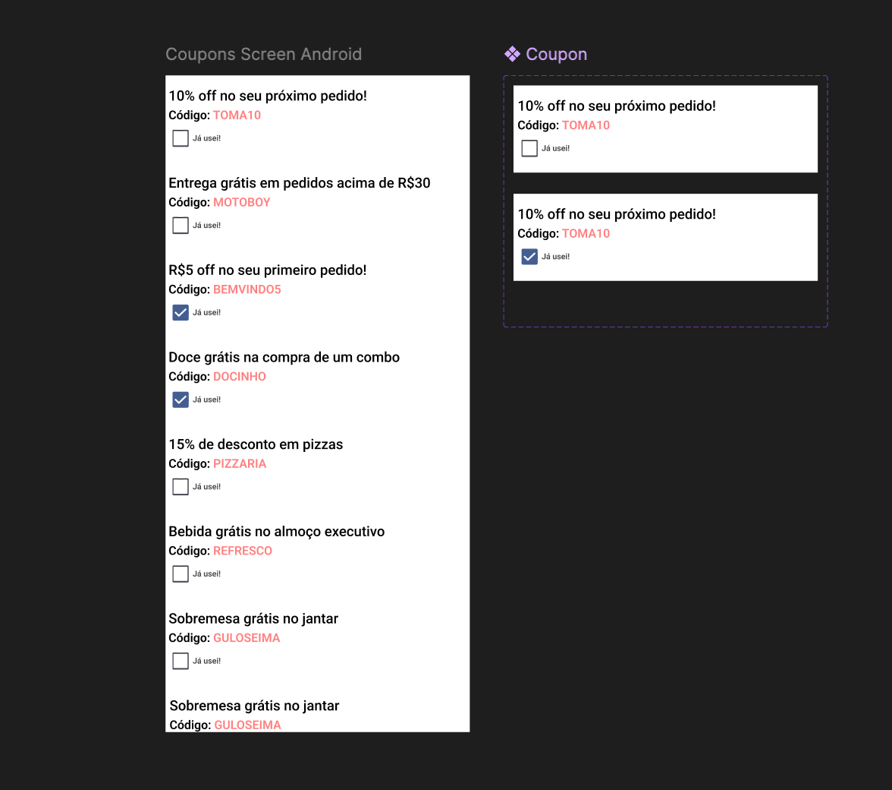

# Desafio Review Android Compose 
## Coupon List Screen
Este projeto contém uma tela exibindo uma lista de cupons para nosso app de delivery. 
A tela permite que os usuários marquem cupons como usados em um checkbox.

O arquivo figma com protótipo está na pasta [assets](assets/Coupons-Screen.fig)

### Objetivo:
Sua tarefa é revisar o código existente para essa tela e identificar áreas para melhoria, possíveis falhas, qualquer coisa que achar interessante. 
Considere as melhores práticas do Compose, gerenciamento de estado, arquiteturas, padrões de projeto, e qualidade geral do código.

### Expectativa:
Cada review depende de muitos fatores, quem escreveu o código, as condições do projeto, prazos, etc,
Então não se preocupe com o quão crítico pode ser, fique livre e a vontade para comentar qualquer ponto e caso não se sinta a vontade, nos avise.

### Entrega - Importante:
Você não precisa escrever nenhum código para este desafio. Articular claramente suas ideias e soluções propostas é suficiente.
Sinta-se à vontade para sugerir quaisquer bibliotecas, padrões ou técnicas que você acredita que melhorariam o código ou a experiência do usuário.
Não há respostas certas ou erradas. Estamos interessados em conhecer seu processo de pensamento e visão geral.

## Como entregar:
Adicione suas ideias no readme ou no próprio código, escreva comentários, faça esboços, etc.
1. Crie um repositório no seu github com o projeto do link recebido por email
2. Crie um pull request no seu repositório para compartilhar suas ideias:

3. Você pode:
   - Adicionar nossos usuários (enviados por email) ao seu repositório para avaliarmos suas ideias propostas. 
   - Ou ainda se preferir apresentar pra gente num papo, avisa a gente.

### Bônus:
- Pense em como você lidaria com um grande número de cupons de forma eficiente.
- Que estratégias você usaria para garantir que a tela permaneça com bom desempenho mesmo com um grande conjunto de dados?

Imagine um cenário maior dessa tela, em que os cupons são retornados de uma api:
1. o que você usaria de arquitetura?
2. Algum padrão de projeto que acha que faz sentido ser adotado.
3. Em relação a UI, alguma coisa mudaria se os dados viessem da api?
4. Alguma(s) biblioteca(s) que faça sentido incorporar nesse caso?
  
Estamos ansiosos para ouvir suas ideias e soluções propostas!
