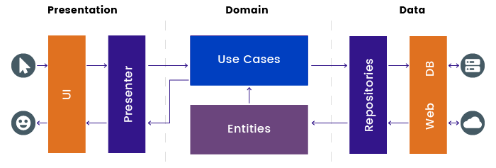
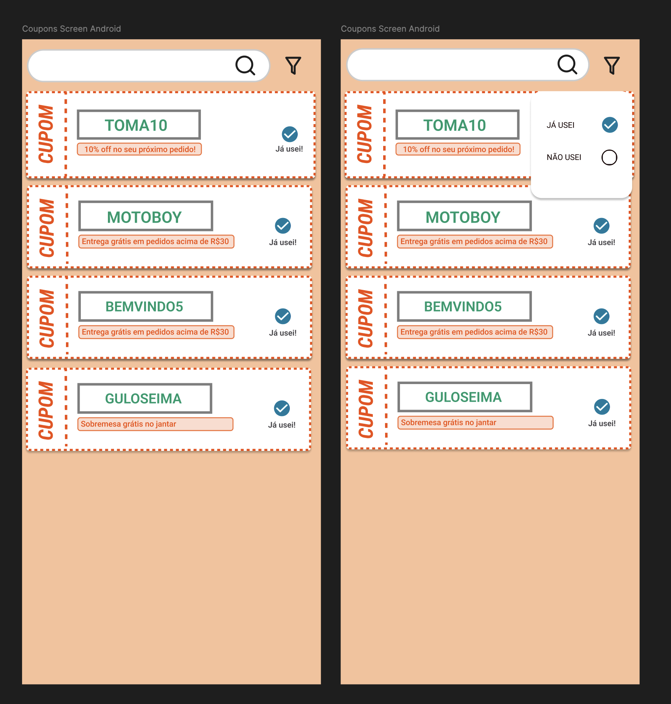

# Delivery Much

## Arquitetura

### MVVM
Apesar de algumas pessoas considerarem o MVI uma boa arquitetura para se trabalhar com Jetpack Compose, o Google não recomenda oficialmente essa arquitetura. Por outro lado, o **MVVM** é um padrão recomendado pelo Google e amplamente documentado, além de oferecer um excelente controle de estado quando usado em conjunto com `LiveData` ou `Flow`. Por isso, decidi utilizar o **MVVM**.

### Clean Architecture
Escolhi o **Clean Architecture** por ser um padrão que separa bem as camadas e responsabilidades, mantendo alta coesão e baixo acoplamento. Mesmo em um projeto pequeno, usar o Clean Architecture o prepara para receber novas funcionalidades, garantindo escalabilidade.

### Injeção de Dependência
Optei pelo **Koin** porque é uma DI leve orientada a Kotlin e fácil de configurar. Ele fornece um controle mais explícito, permitindo uma gestão mais transparente do que acontece no aplicativo, ao contrário do Hilt.

### Network
Para a camada de rede, escolhi o **Ktor**, que tem ganhado aderência na comunidade por funcionar tanto como cliente quanto servidor. Não usei Retrofit porque este é um aplicativo para usuários de múltiplas plataformas (Android e iOS), e o Ktor prepara o app para uma futura migração para KMP, permitindo o compartilhamento de código entre plataformas.

### Room Database
O **Room Database** é usado para armazenar localmente a lista de cupons, permitindo acesso offline e melhorando o desempenho ao reduzir chamadas de rede. Ele facilita a sincronização de dados, mantém o estado local (como cupons usados) e permite filtragem e ordenação rápidas, proporcionando uma experiência de usuário mais fluida e responsiva. Também é compatível com KMP.

### Kotlin Coroutines
As **Kotlin Coroutines** gerenciam operações assíncronas de forma eficiente, como chamadas de rede e acesso ao banco de dados, sem bloquear a UI. Elas facilitam a escrita de código conciso e legível para tarefas de longa duração, melhorando o desempenho e a responsividade do aplicativo. Além disso, simplificam o gerenciamento do fluxo de dados entre o ViewModel e a UI, garantindo atualizações suaves e reativas.

---

## Organização

- [x] Seguir os princípios do Clean Architecture na árvore de pacotes: `data`, `domain`, `presentation` e seus respectivos pacotes internos.
- [x] Criar arquivos conforme o Clean Architecture: `Service`, `DataSource`, `Repository`, `RepositoryImpl`, `UseCase`, `ViewModel`, cada um em seu local apropriado.
- [x] Remover logs que podem ocasionar possíveis bugs.

## UI

- [x] Desmembrar os componentes da `MainActivity`, adicionando as funções composables ao pacote `components` dentro de `presentation`.
- [x] Criar uma classe `Resource` para controle explícito das chamadas (Success, Loading, Error).
- [x] Adicionar um pacote `utils` para conter extension functions ou funções comuns ao app.
- [x] Componente principal do item que receberá os componentes abaixo:
   - [x] Bordas tracejadas para simular papel destacável. (UX é tudo 😉)
   - [x] Componente lateral esquerdo com o nome "CUPOM" em 90º.
   - [x] Componente laranja abaixo do código para mostrar os detalhes do cupom.
   - [x] Componente checkbox para selecionar o cupom usado.
   - [x] Adicionar um filtro para visualizar apenas os cupons desejados, usados ou não.
   - [x] Criar um componente de busca que permita encontrar o cupom pelo nome.

---

## Esboço da Arquitetura

---

## Protótipo do Figma

